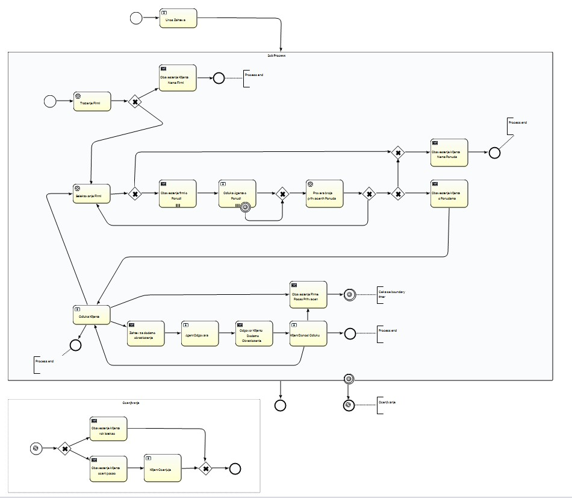
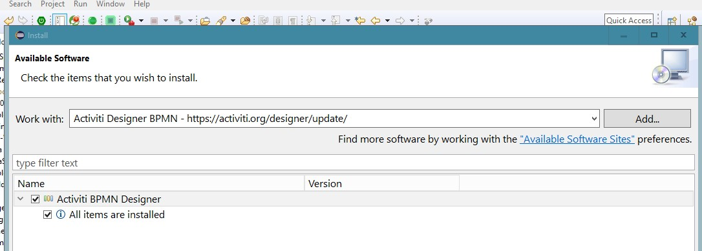
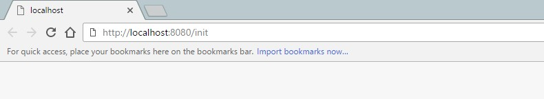

# work-services

Application that implements BPMN model.
It search offers for execution of certain services.



## Getting Started

These instructions will get you a copy of the project up and running on your local machine for development and testing purposes. See deployment for notes on how to deploy the project on a live system.

### Prerequisites

What things you need to install the software and how to install them

```
Download `Apache James Server` - http://james.apache.org/server/index.html
In 'james-read-me.txt' file are some instructions how to configure 'James Server 3.0-beta4'
```
```
Add `Activiti BPMN Designer` plugin to Eclipse - https://activiti.org/designer/update/ 
( Eclipse Toolbar > Help > Install New Software >>> Add ... )
```


### Setup

A step by step series of examples that tell you have to get a development env running

Import project to Eclipse workspace
```
File > Import >>> General > Existing Projects into Workspase
```

Configure as Maven Project

```
Step One: Right click on Project > Configure > Convert to Maven Project
Step Two: Right click on Project > Maven > Update Project...
```

Add 'Apache Tomcat v8.5' library to 'Java Build Path'
```
Right click on Project > Properties >>> Java Build Path
```

Set configurations for the database connection
```
/src/main/resources/application.properties
Because "ddl-auto" is set to "update" Hibernate will create tables in database after first app run.
Run app one time to do that... 
```

To Run Application:
```
Open package `rs.ac.uns.ftn.tseo.ctecdev` in '/src/main/java/' folder 
right there there is a class `Work_Service_App.java`
Right click on that class > Run As > Java Application
Application will run on `http://localhost:8080/`
```
*Note - To run app on some other port, add in application.properties "server.port='<port-number'"

## Running and testing

There is no automated tests, to test app manualu follow instructions :)

### First make sure that app is running 

### Initialize database

In `InitializeController.java` is some data for database

```
To initialize data, run 'InitializeControler' through the browser
Just copy `http://localhost:8080/init` this adress to adress bar and pres enter
```



### Go to Home page (localhost)
```
Go to `http://localhost:8080/` or if you changed port `http://localhost:<port-number>/`
```

### Before start process >>> Configure and Run 'Apache James Server'
SMTP server will run on port 25

### Testing
```
Fastest way to test app is with user named 'ratar'
	- he should engage him self
	- he belongs to a group of jobs Ratarstvo
It should be kept in mind that the process time is limited for a small period of time, for testing purposes, this can be changed within the process itself src/main/resources/processes/MyProcess.bpmn
```

## Built With 

* [ Java 1.8 ]
* [ JSP pages ] - "FrontEnd" 
* [ SpringBoot framework ](https://projects.spring.io/spring-boot/) - BackEnd
* [ Maven ](https://maven.apache.org/) - Dependency Management
* [ Activiti BPMN 2.0 Platform ](https://www.activiti.org/)

## Authors

* **Srđan Jazic** - https://github.com/ctecdev

## Acknowledgments

* This project is developed as part of exam on Faculty of Technical Sciences in Novi Sad
  
